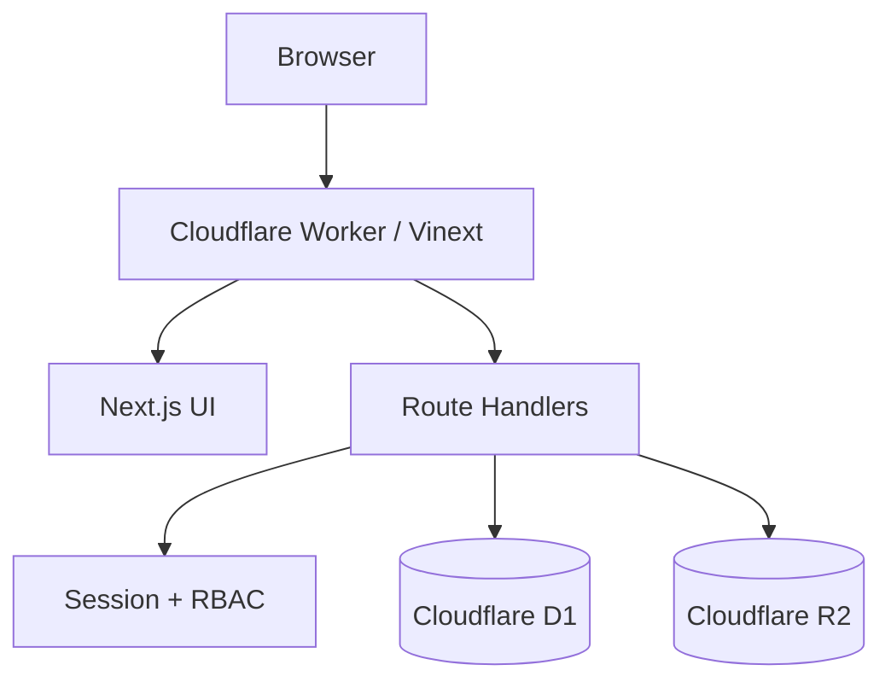

# Odine GRC Architecture

## Bileşenler

## Katmanlar

- `app/page.tsx`: modül navigasyonu, listeler, formlar, dashboard ve denetim çalışma alanları.
- `app/api/auth`: yerel kullanıcı girişi, güçlü parola politikası, hesap kilitleme ve oturum yönetimi.
- `app/api/grc`: modül allowlist'i, sunucu tarafı validasyon, CRUD ve toplu import.
- `app/api/evidence`: dosya boyutu/türü/imzası doğrulaması ve güvenli indirme.
- `app/api/users`: Admin rolüyle kullanıcı ve rol yönetimi.
- `db/` ve `drizzle/`: veri modeli ve sürümlenmiş migration'lar.
- `worker/index.ts`: Cloudflare Worker giriş noktası ve image optimization geçidi.

## Güven sınırları

1. Tarayıcıdan gelen hiçbir rol veya kullanıcı başlığı uygulama rolü olarak kabul edilmez.
2. Yazma işlemleri oturum, rol ve same-origin kontrolünden geçer.
3. Modül, alan, tarih, skor, e-posta ve payload sınırları sunucuda uygulanır.
4. D1 kalıcı kayıt sistemidir; R2 yalnız kanıt dosyalarını tutar.
5. Gizli değerler kaynak kodda veya browser storage'da tutulmamalıdır.

## Veri yaşam döngüsü

- Kayıt kimlikleri UUID ile üretilir.
- Liste API'si en fazla 5.000 kayıt döndürür; import en fazla 1.000 satır kabul eder.
- Oturum belirteçleri veritabanında SHA-256 özetiyle tutulur ve 8 saat sonra sona erer.
- Kanıt indirmeleri `private, no-store`, `nosniff` ve attachment başlıklarıyla sunulur.

## Dağıtım

Build çıktısı `dist/server/index.js` altında ESM Worker ve `dist/.openai/hosting.json` manifesti üretir. D1/R2 binding adları sırasıyla `DB` ve `BUCKET`'tır.
