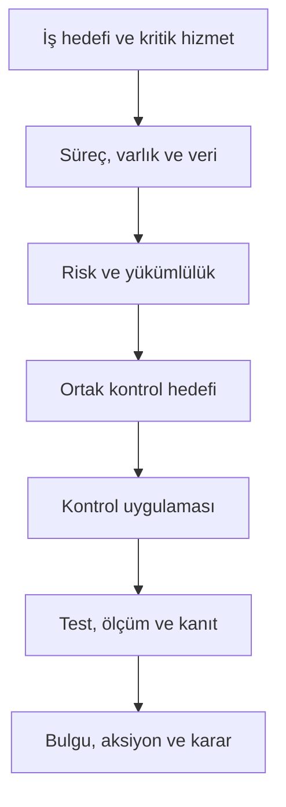

# CISO GRC & Assurance Platform — Master Product Requirements Document

**Belge Kodu:** PRD-001  
**Sürüm:** 1.0  
**Tarih:** 5 Ağustos 2026  
**Durum:** İlk ürün temeli / incelemeye hazır  
**Ürün Sahibi ve Alan Uzmanı:** Yakup Evci  
**Ürün Tasarımı ve Geliştirme:** Yakup Evci + Codex  
**Bağlı Belge:** CISO-GRC-Platform-Project-Charter.md

## 1. Belgenin Amacı

Bu PRD; global ölçekte kullanılabilecek bütünleşik Governance, Risk, Compliance, Audit ve Assurance platformunun ürün sınırlarını, kullanıcılarını, fonksiyonel ve fonksiyonel olmayan gereksinimlerini, iş kurallarını, ana durum akışlarını, raporlarını, entegrasyon yaklaşımını ve kabul ölçütlerini tanımlar.

Bu belge yalnızca ilk yayınlanacak ekranları değil hedef ürünün tamamını kapsar. Uygulama teknik bağımlılık sırasına göre geliştirilecek; fakat aşağıdaki alanların tümü ilk domain ve veri modelinde dikkate alınacaktır.

## 2. Ürün Problemi

Kuruluşlarda risk, kontrol, kanıt, denetim ve yükümlülük bilgisi çoğunlukla Excel, e-posta, dosya paylaşımı, ticket sistemleri ve birbirinden kopuk GRC araçlarında tutulur. Bunun sonuçları:

- Aynı kanıt farklı ekipler ve denetçiler tarafından tekrar tekrar istenir.
- Kontrolün tanımlı olması, gerçekten çalışmasıyla karıştırılır.
- Framework uyumu kanıt ve kapsam dikkate alınmadan basit yüzdeyle gösterilir.
- Risk, kritik hizmet, varlık, kontrol, bulgu ve yatırım arasındaki bağ kaybolur.
- Denetim izi sonradan oluşturulur; kimin, neyi, neden değiştirdiği doğrulanamaz.
- Privacy, TPRM, BCM, AppSec ve AI riskleri ayrı tablolarda yönetilir.
- CISO/CIO ve yönetim kurulu, teknik detaydan karar üretmekte zorlanır.
- Regülasyon değişikliklerinin mevcut kontrol ve süreçlere etkisi manuel analiz edilir.

## 3. Ürün Vizyonu ve Değer Önerisi

Platform; kuruluşun iş hedeflerinden ve kritik hizmetlerinden başlayarak riskleri, kontrol uygulamalarını, kanıtları, denetimleri, bulguları, aksiyonları ve yatırımları ortak bir kontrol grafiğinde birleştiren bir **Cyber Governance Operating System** olacaktır.

Ana değer önerileri:

1. Kanıtı bir kez topla, uygun olduğu her yerde kullan.
2. Framework maddelerini ortak kontrol hedeflerine bağla; tekrar değerlendirmeyi azalt.
3. Kontrol varlığı, tasarım etkinliği, işletim etkinliği ve assurance seviyesini ayır.
4. Riskten kanıta ve yönetim kararına kadar uçtan uca izlenebilirlik sağla.
5. Teknik sistemlerden otomatik kanıt ve kontrol sonucu üret.
6. Global standartlarla Türkiye düzenlemelerini aynı modelde yönet.
7. CISO, CIO, risk, privacy, denetim ve teknik ekipleri tek çalışma alanında buluştur.

## 4. Ürün Hedefleri ve Başarı Ölçütleri

| Hedef | Başarı ölçütü |
|---|---|
| Tekrar kanıt talebini azaltmak | Uygun mevcut kanıtla otomatik karşılanan taleplerin oranı |
| Denetim hazırlığını hızlandırmak | Talep açılışından onaylı kanıta kadar medyan süre |
| Kontrol etkinliğini görünür kılmak | Güncel test ve yeterli kanıta sahip kritik kontrollerin oranı |
| Risk izlenebilirliği sağlamak | Kritik risklerin varlık, kontrol, sahip ve aksiyon bağlarının tamlık oranı |
| Aksiyon disiplinini artırmak | SLA içinde kapanan bulgu/CAPA oranı ve tekrar bulgu oranı |
| Sürekli uygunluk sağlamak | Otomatik test edilen uygun kontrollerin oranı |
| Yönetim kararını desteklemek | Risk azaltımı ve yatırım etkisi hesaplanabilen girişimlerin oranı |
| Veri güvenilirliğini artırmak | Sahibi, kapsamı, tarihi, onayı ve kanıtı eksiksiz kesinleşmiş sonuç oranı |

## 5. Kapsam İlkeleri

- Bütün modüller ortak organizasyon, varlık, yükümlülük, kontrol, risk, kanıt ve workflow servislerini kullanır.
- Hiçbir modül kendi bağımsız kontrol veya kanıt kopyasını yaratmaz.
- Sonuç üreten her kayıt; sahip, kapsam, geçerlilik dönemi, kaynak, onay ve audit trail taşır.
- Ürün Türkçe ve İngilizce çalışır; tarih, sayı ve para birimi yerelleştirilebilir.
- SaaS multi-tenant, dedicated tenant, private cloud ve on-prem dağıtım desteklenir.
- Framework içeriği lisans ve telif koşullarına göre yönetilir.
- AI tarafından oluşturulan hiçbir öneri insan onayı olmadan kesin sonuca dönüşmez.

## 6. Kullanıcı Personaları

| Persona | Ana hedef |
|---|---|
| CISO | Siber risk, kontrol etkinliği, bütçe, yol haritası ve yönetim raporlaması |
| CIO/CTO | Teknoloji riski, dayanıklılık, yatırım ve hizmet bağımlılıkları |
| CRO/Risk yöneticisi | Risk metodolojisi, iştah, agregasyon ve karar takibi |
| Compliance/ISMS yöneticisi | Yükümlülükler, kontroller, gap analizi, SoA ve sertifikasyon |
| Privacy/DPO | ROPA, DPIA, DSAR, veri aktarımı, ihlal ve saklama süreçleri |
| İç denetçi | Audit universe, plan, test, workpaper, bulgu ve bağımsız assurance |
| Dış denetçi/regülatör | Sınırlandırılmış denetim alanı, kanıt ve izlenebilir sonuçlar |
| Kontrol sahibi | Kontrol tasarımı, uygulaması, test sonucu, KCI ve iyileştirme |
| Risk/varlık/süreç sahibi | Kapsam doğrulama, risk kararı, aksiyon ve kabul |
| Teknik güvenlik ekibi | Entegrasyon, otomatik kanıt, zafiyet, olay ve teknik bulgular |
| Aksiyon sahibi | Kendisine atanan işlerin yürütülmesi ve kapanış kanıtı |
| Kanıt sağlayıcı | Kanıt talebini yanıtlama ve kapsam/metadata sağlama |
| Tedarikçi kullanıcısı | Sınırlandırılmış soru formu, kanıt ve düzeltici faaliyet paylaşımı |
| Yönetim kurulu | Özet risk, tolerans aşımı, eğilim, yatırım ve karar görünümü |

## 7. Organizasyon ve Kapsam Modeli

Sistem şu hiyerarşileri ayrı ayrı ve ilişkilendirilebilir biçimde desteklemelidir:

- Tenant, şirket/tüzel kişilik, grup şirketi
- İş birimi, departman, ekip
- Ülke, bölge, lokasyon, tesis
- İş hedefi, süreç, alt süreç
- Ürün, proje, uygulama, kritik/önemli hizmet
- Teknoloji ve veri varlığı
- Tedarikçi ve dördüncü taraf
- Sertifikasyon, denetim ve regülasyon kapsamı

Her kayıt için kapsam; dahil etme/dışlama, kapsam gerekçesi, geçerlilik tarihi ve onay bilgisiyle tutulmalıdır. Tarihsel organizasyon değişiklikleri eski denetim sonuçlarını bozmamalıdır.

## 8. Ortak Domain ve İzlenebilirlik Grafiği

Ana ilişki zinciri:

Zorunlu ilişki kuralları:

- Ortak kontrol hedefi ile kuruma özel kontrol uygulaması ayrı nesnelerdir.
- Risk, kontrol, kanıt, yükümlülük, varlık ve denetim ilişkileri many-to-many çalışır.
- Her ilişki; kaynak, gerekçe, güven seviyesi, onay ve geçerlilik tarihi taşıyabilir.
- Framework versiyon değişiklikleri eski değerlendirmelerin tarihsel bütünlüğünü korur.
- Bir nesnenin silinmesi geçmiş denetim izini yok etmez; kayıt arşivlenir veya anonimleştirilir.

## 9. Fonksiyonel Ürün Gereksinimleri

### 9.1 Kurumsal Yönetişim ve Organizasyon

- Çoklu şirket, iş birimi, lokasyon ve matris organizasyon desteği
- Yönetim komiteleri, görev tanımları, RACI ve vekâlet
- Three Lines Model sorumlulukları
- Stratejik hedef, risk iştahı, politika ve program bağlantıları
- Karar, toplantı, yönetim onayı ve aksiyon kayıtları
- Organizasyon kapsamına göre veri erişimi ve raporlama

**Kabul ölçütleri:** Kullanıcı yalnızca yetkili olduğu organizasyon kapsamındaki kayıtları görür; bir komite kararı ilgili risk, politika, istisna veya yatırımla ilişkilendirilebilir.

### 9.2 Enterprise, Cyber ve IT Risk Yönetimi

- Yapılandırılabilir risk taksonomisi ve risk kayıtları
- Risk senaryosu: varlık/değer, tehdit olayı, zayıflık, sonuç
- Doğal, artık ve hedef risk
- 3x3, 4x4, 5x5 ve parametrik matrisler
- Finansal, operasyonel, yasal, müşteri, güvenlik, privacy, itibar ve dayanıklılık etkileri
- FAIR uyumlu nicel risk analizi ve Monte Carlo için genişletilebilir model
- Risk iştahı, tolerans, kapasite ve eşik ihlalleri
- Risk agregasyonu, konsantrasyon ve ortak neden analizi
- Tedavi seçenekleri: azalt, kabul et, kaçın, transfer et, izle
- Süreli risk kabulü, maker-checker ve yeniden değerlendirme
- KRI, erken uyarı, trend ve kayıp olayları
- Risk workshop, challenge ve bağımsız ikinci hat değerlendirmesi

**Temel kural:** Artık risk, kontrol etkinliği bilinmeden otomatik olarak düşük gösterilemez. Manuel skor değişikliği gerekçe ve onay gerektirir.

### 9.3 Varlık, Süreç, Hizmet, Veri ve Bağımlılık Yönetimi

- Donanım, yazılım, uygulama, bulut, kimlik, ağ, veri, tesis ve insan kaynağı varlıkları
- Sahip, emanetçi, teknik sorumlu, kritiklik, yaşam döngüsü ve kaynak sistemi
- İş süreci ve kritik/önemli hizmet kataloğu
- Yukarı/aşağı bağımlılık haritası ve single point of failure
- Veri sınıflandırması, kişisel veri, yerleşim ve işleme bağlamı
- CMDB ve discovery araçlarından senkronizasyon
- Kapsam dışı bırakma için gerekçe ve onay
- Sertifikasyon, PCI CDE, DORA critical function ve benzeri kapsam etiketleri

### 9.4 Unified Control Library

- Ortak kontrol hedefi, kontrol ailesi ve alt kontrol
- Kuruma özel kontrol uygulaması ve prosedürü
- Preventive/detective/corrective; manual/automated/hybrid sınıfları
- Kontrol sahibi, uygulayan, test eden ve onaylayan ayrımı
- Kontrol kapsamı, sıklığı, tetikleyicisi ve bağımlılıkları
- Ana, telafi edici, devralınan ve ortak hizmet kontrolü
- Tasarım etkinliği, işletim etkinliği, kapsam yeterliliği ve otomasyon düzeyi
- Test prosedürü, beklenen kanıt, popülasyon ve örneklem metodu
- KCI/KPI bağlantısı, exception ve başarısızlık toleransı
- Kontrol versiyonlama, değişiklik etkisi ve emeklilik

**Temel kural:** Aynı kontrolün farklı varlıklardaki uygulamaları ayrı sonuç üretebilir; ana kontrol kütüphanesini kopyalamaz.

### 9.5 Framework, Regülasyon ve Yükümlülük Yönetimi

- Framework/regülasyon kataloğu, versiyon ve yürürlük tarihleri
- Madde, alt madde, açıklama, yorum, rehberlik ve kaynak bağlantısı
- Yargı alanı, sektör, şirket tipi ve eşik bazlı uygulanabilirlik
- Ortak kontrol hedeflerine cross-mapping
- Mapping kaynağı, gerekçesi, güven seviyesi ve uzman onayı
- Uygulanabilirlik değerlendirmesi ve kapsam dışı gerekçesi
- Gap assessment, SoA, uyum planı ve sertifikasyon yaşam döngüsü
- Yasal, düzenleyici, sözleşmesel ve gönüllü yükümlülük ayrımı
- Regulatory change intake, etki analizi, görev ve uygulama doğrulaması
- Lisanslı, açık veya müşteri tarafından sağlanan içerik modeli
- OSCAL uyumlu import/export

Başlangıç katalog aileleri; ISO 27000, NIST, CIS, COBIT, CSA, OWASP, PCI, SOC, SWIFT, SOX, DORA, NIS2, EBA, BDDK, TCMB, KVKK, GDPR, ISO 22301 ve AI governance standartlarını kapsar.

### 9.6 Kanıt Kasası ve Evidence Eligibility Engine

- Benzersiz `EVD-YYYY-NNNNNN` kimliği
- Dosya, API çıktısı, sorgu sonucu, bağlantı, beyan ve fiziksel kayıt tipleri
- Sürüm, SHA-256 hash, kaynak, collector sürümü ve toplama yöntemi
- Organizasyon, varlık, kontrol, dönem, popülasyon ve örneklem kapsamı
- Toplanma, geçerlilik, sona erme ve saklama tarihleri
- Gizlilik sınıfı, kişisel veri, legal hold ve denetçi gösterim izni
- Sağlayıcı, sahip, inceleyen ve onaylayan
- Kanıt güven seviyesi: sistem üretimli, bağımsız doğrulanmış, yönetim beyanı vb.
- Malware taraması, hassas veri tespiti, maskeleme ve kontrollü indirme
- WORM/Object Lock opsiyonu ve bütünlük kontrolü
- Kanıt talebi ile mevcut kanıtın otomatik eşleştirilmesi
- Tekrar talep için zorunlu gerekçe ve onay
- Süresi dolacak kanıt ve kapsam değişikliği bildirimleri

**Uygunluk motoru karar boyutları:** kontrol iddiası, organizasyon/varlık kapsamı, dönem, güncellik, popülasyon, örneklem, kaynak güveni, onay, bütünlük, gizlilik ve denetçi kullanım izni.

**Sonuçlar:** Uygun, koşullu uygun, yetersiz, süresi dolmuş, kapsam dışı, inceleme gerekli.

### 9.7 Continuous Controls Monitoring ve Entegrasyonlar

- Connector/collector kataloğu, kimlik bilgisi referansı ve sağlık durumu
- Zamanlanmış, olay tetiklemeli ve manuel toplama
- Ham çıktı ile normalize edilmiş sonucun birlikte saklanması
- Kontrol testi, başarısız varlık, istisna ve trend üretimi
- Veri kaynağı kesintisinde “başarılı” yerine “bilinmiyor/veri yok” sonucu
- Collector sürümü ve sorgu/policy versiyonunun kaydı
- Rate limit, retry, idempotency, delta sync ve hata kuyruğu
- Secret vault entegrasyonu ve en az yetki
- Connector doğruluk testi ve müşteri onayı

Öncelikli örnekler: Entra ID MFA/roller, Intune encryption/compliance, Defender/Cortex coverage, Nessus zafiyet/SLA, Sentinel log kaynağı, Purview DLP, Wazuh agent, Fortinet policy, PAM enrollment, Azure/AWS/GCP posture, backup/restore, HR termination ve Git branch protection.

### 9.8 Denetim ve Assurance Yönetimi

- Audit universe ve denetlenebilir birimler
- Risk bazlı yıllık/çok yıllı denetim planı ve kapasite
- İç denetim, dış denetim, sertifikasyon, müşteri ve regülatör denetimi türleri
- Denetçi yetkinliği, bağımsızlık ve çıkar çatışması beyanı
- Kapsam, hedef, kriter, zaman planı ve ekip
- PBC/kanıt talep listesi, portal ve güvenli iletişim
- Audit programı, test adımı, örneklem, workpaper ve review note
- Tasarım ve işletim etkinliği testleri
- Bulgu, observation, conformity/nonconformity ve önem derecesi
- Yönetim cevabı, kök neden, CAPA, aksiyon ve hedef tarih
- Kapanış doğrulaması, yeniden açma ve repeat finding tespiti
- Audit opinion, assurance rating ve rapor onayı
- Tek tık kanıt paketi ve indeks

**Temel kural:** Bulgu, bulguyu açan kişi tarafından tek başına kapatılamaz. Kapanış kanıtı ve bağımsız doğrulama gerekir.

### 9.9 Bulgu, Aksiyon, CAPA, İstisna ve Risk Kabulü

- Ortak finding modeli: audit, kontrol testi, zafiyet, olay, privacy, tedarikçi ve regülasyon kaynakları
- Önem derecesi, etki, olasılık, etkilenen kapsam ve risk bağlantısı
- Kök neden taksonomisi ve 5 Why/Fishbone desteği
- Düzeltme, düzeltici faaliyet, önleyici faaliyet ve milestone
- SLA, gecikme, eskalasyon ve yönetim görünürlüğü
- Kapanış kanıtı, doğrulayan ve etkinlik kontrolü
- İstisna/waiver, telafi edici kontrol ve son kullanma tarihi
- Süreli risk kabulü, kabul yetki limitleri ve komite onayı
- Tekrar bulgu ve birleştirme önerisi

### 9.10 Politika, Prosedür ve Doküman Yönetimi

- Politika hiyerarşisi: politika, standart, prosedür, rehber, form, kayıt
- Belge sahibi, onaylayan, sınıf, versiyon, yürürlük ve gözden geçirme tarihi
- Taslak, inceleme, onay, yayın, yürürlük, geri çekme ve arşiv durumları
- Maker-checker, yorum/redline, dağıtım ve çalışan attestation
- Yükümlülük, kontrol, risk ve eğitim bağlantıları
- Şablon, numaralandırma, PDF yayın ve kontrollü kopya
- İstisna ve politika ihlali süreçleri

### 9.11 Privacy ve Veri Yönetişimi

- Veri işleme faaliyet envanteri/ROPA
- Veri sahibi, veri işleyen, ortak veri sorumlusu ve alt işleyen ilişkileri
- Veri kategorisi, ilgili kişi, amaç, hukuki sebep ve açık rıza
- Özel nitelikli veri, veri yerleşimi ve sınır ötesi aktarım
- Saklama/imha planı ve veri minimizasyonu
- DPIA/PIA, TIA ve privacy risk değerlendirmesi
- DSAR/ilgili kişi başvurusu ve yasal süre takibi
- Consent ve preference yönetimi için genişletilebilir yapı
- Privacy incident, ihlal değerlendirmesi ve otorite/ilgili kişi bildirimi
- KVKK VERBİS karşılaştırması ve GDPR ROPA çıktıları
- Teknik/idari tedbirlerin ortak kontrol kütüphanesine bağlanması

### 9.12 Üçüncü ve Dördüncü Taraf Risk Yönetimi

- Tedarikçi envanteri, hizmet, veri erişimi, lokasyon ve iş sahibi
- Inherent risk tiering ve due diligence kapsamı
- Yapılandırılabilir soru formu ve kanıt talepleri
- Sertifika/SOC raporu inceleme, bridge letter ve istisna takibi
- Sözleşme maddesi kütüphanesi, DPA, SLA, denetim hakkı ve bildirim süreleri
- Sürekli izleme, finansal/siber sinyal ve yeniden değerlendirme
- Dördüncü taraf, coğrafi ve teknoloji konsantrasyon riski
- DORA ICT register of information için veri alanları
- Onboarding, değişiklik, yenileme, offboarding ve exit strategy
- Tedarikçi bulgusu, CAPA ve risk kabulü

### 9.13 BIA, BCM, Kriz ve Operasyonel Dayanıklılık

- Kritik süreç ve önemli hizmet tanımı
- BIA: MTPD/MAO, RTO, RPO, minimum hizmet seviyesi ve etki eğrisi
- İnsan, tesis, teknoloji, veri ve tedarikçi bağımlılıkları
- İş sürekliliği, IT disaster recovery ve crisis planları
- Çağrı ağacı, kriz rolü, iletişim şablonu ve karar kaydı
- Tabletop, failover, restore ve teknik dayanıklılık testleri
- Test senaryosu, hedef, gerçek sonuç, dersler ve iyileştirme
- DORA/NIS2 operasyonel dayanıklılık ve TLPT bağlantıları
- Plan versiyonu, gözden geçirme, attestation ve uygulanabilirlik

### 9.14 Olay, Zafiyet, Pentest ve Teknik Bulgu Yönetimi

- Güvenlik olayı referansı, sınıflandırma, iş etkisi ve ilgili risk/kontrol
- Regülatör bildirim karar ağacı, süre ve kayıt
- Zafiyet kaynağı, CVE/CWE, varlık, exploitability, exposure ve iş kritiklik zenginleştirmesi
- SLA, risk bazlı öncelik, istisna, false positive ve kabul
- Pentest, red team, purple team ve control validation sonuçları
- Tekrarlanan/aynı kök nedenli teknik bulguların birleştirilmesi
- SIEM/SOAR, scanner ve ticket araçlarıyla çift yönlü senkronizasyon
- Teknik detay ile yönetim risk görünümünün ayrılması

### 9.15 Identity Governance, PAM ve Erişim Gözden Geçirme

- Kimlik, hesap, entitlement, grup, rol ve ayrıcalık envanteri
- Joiner/mover/leaver kontrol sonuçları
- Periyodik access review/certification kampanyaları
- Manager, resource owner ve application owner review
- SoD kuralı, çakışma, telafi edici kontrol ve istisna
- Privileged account/PAM onboarding, session ve credential rotation kontrolleri
- Orphan, dormant, guest, service ve shared account riskleri
- Entra ID/AD/HR/PAM/uygulama entegrasyonları

### 9.16 Secure SDLC, AppSec, Cloud ve DevSecOps

- Uygulama/proje envanteri, data classification ve criticality
- Security requirement, threat model ve architecture review
- SAST, DAST, SCA, IaC, container, secret ve API security sonuçları
- CI/CD quality gate, exception ve release risk acceptance
- SBOM, component provenance, SLSA ve supply chain kontrolleri
- Cloud account/subscription/project, landing zone ve posture kontrolleri
- OWASP ASVS/SAMM, NIST SSDF ve iç güvenlik standardı mapping
- Remediation SLA ve developer workflow entegrasyonu

### 9.17 Farkındalık, İnsan Kaynakları, Fiziksel ve Çevresel Güvenlik

- Rol bazlı farkındalık programı, eğitim, sınav ve attestation
- Phishing simulation sonucu ve riskli kullanıcı trendi
- Background check, gizlilik taahhüdü ve disiplin süreci kontrolleri
- Onboarding/offboarding görevleri
- Fiziksel lokasyon, zone, erişim, ziyaretçi, CCTV ve çevresel kontrol kayıtları
- Yangın, enerji, sıcaklık, su ve tesis süreklilik kontrolleri
- Privacy ve çalışan haklarına uygun veri minimizasyonu

### 9.18 AI Governance ve AI Risk Management

- AI kullanım senaryosu, sistem/model ve vendor envanteri
- Amaç, sahip, kullanıcı, etkilenen kişi ve karar etkisi
- EU AI Act risk sınıfı ve yasak/yüksek risk değerlendirmesi
- Veri kökeni, kalite, kişisel veri, telif ve saklama
- Model card, performans, fairness, explainability ve drift
- Human oversight, appeal ve kill switch
- Prompt injection, data leakage, model abuse ve supply chain kontrolleri
- AI incident, değişiklik, validasyon ve periyodik izleme
- ISO 42001, NIST AI RMF ve OWASP LLM bağlantıları

### 9.19 Strateji, Bütçe, Program ve Yol Haritası

- Güvenlik hedefi, program, proje, milestone ve bağımlılık
- Risk/kontrol gap’i ile yatırım ilişkilendirme
- CAPEX/OPEX, kaynak, lisans ve operasyon maliyeti
- Beklenen risk azaltımı, kapsam ve fayda
- Alternatif yatırım senaryoları ve önceliklendirme
- Yönetim kararı, bütçe onayı ve gerçekleşen fayda takibi
- Olgunluk hedefi ve çok yıllı yol haritası

### 9.20 Raporlama, Dashboard ve Karar Desteği

Dashboardlar persona ve kapsam bazlı olmalıdır. Minimum göstergeler:

- Risk heatmap, top risk, iştah/tolerans aşımı ve trend
- Kritik hizmet ve varlık risk görünümü
- Kontrol uygulama, tasarım etkinliği, işletim etkinliği ve kapsam
- Kanıt güvencesi, süresi dolacak kanıt ve yeniden kullanım oranı
- Framework/regülasyon uygunluğu ve gap eğilimi
- Açık/gecikmiş bulgu, CAPA ve tekrar bulgu
- Denetim planı, PBC ilerlemesi ve assurance sonucu
- Privacy, vendor, BCM, vulnerability, access review ve AI risk özetleri
- KRI/KPI/KCI ve eşik ihlalleri
- Yatırımın kapsadığı risk ve yükümlülükler

**Skorlama ilkesi:** Basit kontrol sayısı yüzdesi kullanılmaz. Uygulama, etkinlik, kanıt güvencesi, kapsam ve olgunluk ayrı gösterilir; bileşik skorun ağırlıkları ve veri kalitesi görünür olur.

### 9.21 Workflow, Görev ve Bildirim Motoru

- Form, koşul, durum, görev, zamanlayıcı, onay, eskalasyon ve webhook adımları
- Kodsuz şablon yapılandırması ve versiyonlama
- Maker-checker ve görevler ayrılığı
- İş günü/tatil takvimi, SLA ve vekâlet
- E-posta ve uygulama içi bildirim; Teams, Slack, Jira/ServiceNow entegrasyonu
- Bildirim tercihleri, digest ve kritik olay override
- Workflow değişikliğinin devam eden kayıtlar üzerindeki versiyonlu davranışı

### 9.22 Arama, İçe/Dışa Aktarım ve Toplu İşlemler

- Yetkiye duyarlı global arama ve ilişki grafiği
- Filtre, kayıtlı görünüm, özel kolon ve paylaşılabilir rapor
- Excel/CSV kontrollü import, mapping, önizleme ve hata raporu
- Excel, PDF, Word, JSON, YAML ve OSCAL export
- Büyük işlerde asenkron job, ilerleme ve yeniden deneme
- Toplu atama/değişikliklerde yetki, önizleme, gerekçe ve audit trail

## 10. Uyum ve Kontrol Skorlama Modeli

Kontrol sonuçları yapılandırılabilir olmakla birlikte referans değerler:

| Sonuç | Referans puan |
|---|---:|
| Etkin | 100 |
| Büyük ölçüde etkin | 75 |
| Kısmen etkin | 50 |
| Planlandı | 20 |
| Uygulanmadı | 0 |
| Bilinmiyor/veri yok | Skora dahil edilmez, veri kalitesi açığı oluşturur |
| Uygulanamaz | Paydadan çıkarılır; gerekçe ve onay gerekir |

Referans ağırlıklı hesap:

\[
Skor = \frac{\sum (Kontrol\ Ağırlığı \times Sonuç\ Puanı)}{\sum Uygulanabilir\ Kontrol\ Ağırlığı}
\]

Ek kurallar:

- Ağırlık; risk kritiklik, yükümlülük önemi, varlık kapsamı ve kontrol bağımlılığına göre belirlenebilir.
- Güncel test veya yeterli kanıt yoksa sonuç “doğrulanmamış” olarak işaretlenir.
- Düşük örneklem, dar kapsam veya süresi geçmiş kanıt güven skorunu azaltır; kontrol sonucunu gizlice değiştirmez.
- Framework mapping’lerinin güven seviyesi raporlanır.
- Skorun hesap tarihi, kullanılan veri sürümleri ve formül versiyonu saklanır.
- Kullanıcı skorun bileşenlerine drill-down yapabilir.

## 11. Ana Durum Makineleri

### Risk

`Taslak → Değerlendirmede → Challenge/İnceleme → Onaylı → Tedavide/İzlemede → Kapanış İncelemesi → Kapatıldı`  
Yan durumlar: Kabul bekliyor, kabul edildi, süresi doldu, yeniden açıldı.

### Kontrol uygulaması

`Taslak → Tasarım incelemesi → Uygulamada → Aktif → Test bekliyor → Etkin/Kısmen etkin/Etkin değil → İyileştirmede → Emekli`

### Kanıt

`Talep edildi → Sağlandı/Toplandı → Güvenlik taraması → İncelemede → Onaylı/Koşullu/Red → Süresi doldu → Arşiv`

### Denetim

`Öneri → Planlandı → Hazırlık → Saha çalışması → Raporlama → Yönetim cevabı → Takip → Kapatıldı`

### Bulgu/Aksiyon

`Taslak → Doğrulandı → Atandı → Devam ediyor → Kapanış talebi → Doğrulama → Kapatıldı`  
Yan durumlar: Gecikmiş, risk kabulünde, reddedildi, yeniden açıldı.

### Politika

`Taslak → İnceleme → Onay → Yayınlandı → Yürürlükte → Gözden geçirme → Geri çekildi/Arşiv`

## 12. Yetkilendirme ve Görevler Ayrılığı

Yetkilendirme RBAC + ABAC birleşimiyle yapılır. Politika bağlamı:

- Tenant/şirket/iş birimi/lokasyon
- Modül ve kayıt tipi
- Kayıt sahipliği ve atama
- Framework/denetim kapsamı
- Veri gizlilik seviyesi ve kişisel veri
- İşlem türü: görüntüleme, oluşturma, değiştirme, onay, export, indirme, yönetim
- Zaman, oturum güveni, ağ/IP ve dağıtım politikası

Maker-checker zorunlu işlemler:

- Risk kabulü ve iştah/tolerans istisnası
- Kontrol sonucu veya skorun manuel değiştirilmesi
- Kanıt onayı ve kanıtın denetçiye açılması
- Bulgu kapanışı ve yeniden sınıflandırma
- Uygulanamazlık/kapsam dışı kararı
- Framework sonucu ve SoA onayı
- Politika yayınlama
- Kritik veri export’u ve silme
- Connector credential/izin değişikliği

## 13. Audit Trail ve Kayıt Bütünlüğü

Her kritik olay için:

- Tenant, kullanıcı/servis kimliği, rol ve oturum
- Tarih-saat, istemci ve korelasyon kimliği
- Nesne ve işlem
- Önceki/sonraki değer veya değişiklik özeti
- Gerekçe, onay ve workflow referansı
- Kaynak IP/cihaz bağlamı (politika ve privacy sınırları içinde)
- İlgili kayıt ve kanıt hash’i

Audit kayıtları append-only olmalı; yetkili yöneticiler dahi değiştirememeli, saklama ve legal hold politikaları uygulanmalıdır. Audit export’ları SIEM’e iletilebilmelidir.

## 14. Fonksiyonel Olmayan Gereksinimler

### Güvenlik

- OIDC/SAML SSO, MFA ve SCIM
- OWASP ASVS tabanlı uygulama güvenliği
- Saklamada ve aktarımda şifreleme; müşteri bazlı anahtar/BYOK opsiyonu
- Secret vault, key rotation ve kısa ömürlü erişim
- Tenant isolation ve PostgreSQL row-level security dahil katmanlı koruma
- CSP, CSRF, XSS, SSRF, injection, broken access control ve dosya yükleme korumaları
- SAST, DAST, SCA, secret scanning, IaC/container taraması ve pentest
- Güvenli export, watermark, maskeleme, indirme kısıtı ve oturum politikaları
- Güvenlik olayı kayıtları ve müşteri bildirim süreci

### Performans ve Ölçek

- Standart liste/dashboard işlemleri için hedef p95 yanıt süresi 2 saniye
- Ağır rapor ve import/export işlemleri asenkron çalışır
- Büyük tenantlarda milyonlarca ilişki ve kanıt metadata kaydı için bölümlenebilir mimari
- Collector ve job işlemleri idempotent ve tekrar başlatılabilir olmalıdır

### Kullanılabilirlik ve Erişilebilirlik

- Responsive web ve mobil uyumlu yönetici görünümü
- WCAG 2.2 AA hedefi
- Klavye kullanımı, ekran okuyucu ve yüksek kontrast
- Tutarlı tasarım sistemi, boş durum, hata, yardım ve açıklanabilir skorlar
- Kritik işlemlerde açık onay ve geri alınabilirlik

### Erişilebilirlik, Dayanıklılık ve Kurtarma

- SaaS için hedef aylık erişilebilirlik %99,9 veya paket bazlı daha yüksek seçenek
- Çok bölgeli yedekleme, point-in-time recovery ve düzenli restore testi
- RPO/RTO müşteri paketi ve dağıtım modeline göre tanımlanır
- Degraded mode, job retry, health monitoring ve kapasite uyarıları

### Privacy ve Veri Yaşam Döngüsü

- Veri minimizasyonu, amaçla sınırlılık ve yapılandırılabilir saklama
- Tenant/region bazlı veri yerleşimi
- Legal hold, export, silme ve anonimleştirme
- Alt işleyen ve telemetri şeffaflığı
- Non-production ortamında maskeli/sentetik veri

### Taşınabilirlik ve İşletilebilirlik

- SaaS, dedicated, private cloud ve on-prem aynı ürün çekirdeğini kullanır
- Container tabanlı dağıtım ve Infrastructure as Code
- Gözlemlenebilirlik: log, metric, trace, audit ve health check
- Versiyonlu public API, webhook ve connector SDK
- Feature flag ve kontrollü migration/rollback

## 15. AI Özellikleri ve Güvenlik Sınırları

AI kullanım alanları:

- Risk senaryosu ve kontrol önerisi
- Mükerrer risk/bulgu tespiti
- Kanıtın ilgili kontrol ve taleplerle eşleştirilmesi
- Politika/framework gap analizi
- Kök neden ve aksiyon önerisi
- Regülasyon değişikliği etki analizi
- Kanıtta hassas veri tespiti ve redaksiyon önerisi
- Yönetim kurulu özeti ve doğal dilde arama
- Trend ve anomali analizi

Zorunlu güvenlik ilkeleri:

- AI çıktısı öneri etiketi, model/sürüm ve gerekçe taşır.
- İnsan onayı olmadan risk, uygunluk, bulgu kapanışı veya kanıt onayı yapamaz.
- Tenant verisi varsayılan olarak genel model eğitimi için kullanılmaz.
- Prompt/output, erişim yetkisini aşan kayıtları içeremez.
- Kaynak kayda referans ve güven seviyesi gösterilir.
- Prompt injection, veri sızıntısı, model erişimi ve kullanım kayıtları izlenir.
- Müşteri AI özelliklerini kapatabilir ve dağıtım modelini seçebilir.

## 16. Rapor ve Çıktı Kataloğu

- CISO/CIO yönetim özeti ve yönetim kurulu paketi
- Enterprise/cyber/privacy/vendor/AI risk raporları
- Risk appetite breach ve top risk raporu
- Kontrol etkinliği ve assurance raporu
- Framework gap, cross-mapping ve uygunluk raporu
- ISO 27001 SoA ve iç tetkik çıktıları
- PCI scope, control/evidence ve TRA kayıtları
- SOC 1/SOC 2 kontrol-test-evidence çalışma çıktıları
- DORA ICT risk, incident, resilience ve third-party kayıtları
- KVKK/GDPR ROPA, DPIA, DSAR ve saklama raporları
- Denetim planı, workpaper, bulgu, CAPA ve takip raporu
- Kanıt indeksi, hash/bütünlük raporu ve denetim paketi
- BIA, RTO/RPO, plan ve test raporu
- Vendor due diligence, sözleşme gap ve konsantrasyon raporu
- Access review ve SoD raporu
- Zafiyet SLA, exception ve risk bazlı öncelik raporu
- Program, bütçe ve risk azaltımı raporu

## 17. Entegrasyon İlkeleri

Entegrasyon türleri:

- Hazır connector
- REST/GraphQL API ve webhook
- Dosya/SFTP kontrollü aktarım
- SIEM/syslog/event stream
- Veritabanı/read-only query connector
- RPA/manual attestation fallback
- Connector SDK ve müşteri özel entegrasyonu

Her entegrasyon için veri sahibi, hukuki dayanak, izin kapsamı, secret yönetimi, senkronizasyon yönü, sıklık, veri eşleme, hata yönetimi, sağlık durumu ve audit kaydı tanımlanır.

## 18. Teknik Mimari Yönü

- Frontend: React/Next.js ve tip güvenli tasarım sistemi
- Backend: domain sınırları belirlenmiş .NET veya NestJS modüler monolith
- Veritabanı: PostgreSQL, tenant isolation ve RLS
- Kanıt deposu: S3 uyumlu object storage, versioning ve object lock
- Arama: PostgreSQL FTS; ölçek gereksiniminde OpenSearch
- Workflow/job: uygulama içi orkestrasyon; karmaşık süreçlerde Temporal uyumu
- Mesajlaşma: outbox pattern ve managed queue/RabbitMQ uyumu
- Kimlik: Entra ID, Okta, ADFS ve standart OIDC/SAML
- Raporlama: sunucu taraflı PDF/Excel/Word ve makine okunabilir export
- Gözlemlenebilirlik: OpenTelemetry uyumlu log, metric ve trace

Kesin teknoloji kararları Architecture Decision Record (ADR) ile verilecektir.

## 19. Veri Göçü ve Müşteri Onboarding

- Organizasyon ve rol kurulumu
- Mevcut Excel risk/kontrol/bulgu/varlık verisi için şablonlar
- Veri mapping, dry-run, doğrulama ve reconciliation raporu
- Framework lisans ve içerik kurulumu
- SSO/SCIM ve yetki doğrulaması
- Connector kurulumu ve least privilege incelemesi
- Başlangıç risk/control workshop ve sahip atamaları
- Pilot kapsam, kabul ve üretime geçiş kontrol listesi
- Export/exit ve müşteri verisi silme prosedürü

## 20. Ürün Analitiği ve Telemetri

Privacy-preserving ürün analitiği şu soruları yanıtlamalıdır:

- Hangi modüller ve akışlar kullanılıyor?
- Kullanıcılar hangi adımlarda takılıyor?
- Kanıt taleplerinin ne kadarı tekrar kullanım ile kapandı?
- Dashboard ve raporlar ne sıklıkla kullanılıyor?
- Connector hata ve veri gecikmeleri nedir?
- Ortalama denetim, risk review ve bulgu kapanış süreleri nedir?

Müşteri içerikleri analitik amacıyla toplanmaz; telemetri kapatılabilir ve on-prem için yerel tutulabilir.

## 21. Geliştirme Dilimleri ve Bağımlılık Sırası

Bu sıra ürün kapsamını fazlara bölmez; bütün hedef model korunarak çalışan parçaların inşa sırasını tanımlar.

1. Repo, CI/CD, güvenlik tabanı, tasarım sistemi ve tenant/kimlik
2. Organizasyon, kullanıcı, rol/ABAC, audit trail ve ortak workflow
3. Ortak domain graph, varlık/süreç/hizmet/veri modeli
4. Risk, yükümlülük, framework ve unified control library
5. Kanıt kasası, talep ve Evidence Eligibility Engine
6. Kontrol testleri, CCM ve ilk Microsoft/Nessus connector örnekleri
7. Denetim, workpaper, bulgu, CAPA, istisna ve risk kabulü
8. Dashboard, skorlar, rapor/export ve yönetim görünümü
9. Privacy, TPRM, BCM/resilience ve policy management akışları
10. Identity governance, AppSec/cloud, olay/zafiyet ve awareness/fiziksel güvenlik
11. AI governance, AI yardımcıları, strateji/bütçe ve ileri karar desteği
12. OSCAL/compliance-as-code, connector SDK, on-prem ve enterprise hardening

Her dilim; domain modeli, API, arayüz, yetki, audit, test, dokümantasyon ve migration ile tamamlanmış sayılır.

## 22. Yayın Kalite Kapıları

- Ürün sahibi kabulü ve iş kuralı doğrulaması
- Unit, integration, contract, E2E ve accessibility testleri
- Yetkilendirme ve tenant isolation negatif testleri
- SAST, SCA, secret, IaC/container taraması ve DAST
- Threat model ve abuse case incelemesi
- Audit trail ve veri bütünlüğü doğrulaması
- Backup/restore ve migration testi
- Performans ve kapasite testi
- Türkçe/İngilizce içerik ve yerelleştirme kontrolü
- Kullanıcı dokümantasyonu ve release note

## 23. İlk Çalışan Ürün Kesiti Kabul Kriterleri

İlk ürün kesiti aşağıdaki uçtan uca senaryoyu çalıştırmalıdır:

1. Tenant, şirket, iş birimi, kullanıcı ve roller oluşturulur.
2. Kritik hizmet ve ona bağlı varlık kaydedilir.
3. Risk senaryosu oluşturulur ve onaya gönderilir.
4. ISO/NIST benzeri en az iki yükümlülük ortak kontrol hedefine bağlanır.
5. Kuruma özel kontrol uygulaması ve sahibi tanımlanır.
6. Kanıt talebi açılır veya dosya/API kanıtı toplanır.
7. Kanıt kapsam, dönem, bütünlük ve onay açısından değerlendirilir.
8. Kontrol testi tasarım/işletim sonucu üretir.
9. Başarısız sonuç otomatik bulgu ve aksiyon açar.
10. Yetkili kişi maker-checker ile kapanışı doğrular.
11. Dashboard risk, kontrol etkinliği ve kanıt güvencesini ayrı gösterir.
12. Denetim izi ve kanıt indeksi export edilir.

## 24. Açık Ürün Kararları

Aşağıdaki kararlar ADR veya ürün kararı olarak netleştirilecektir:

- Ürün adı ve marka kimliği
- Backend: .NET mi NestJS mi?
- Workflow: uygulama içi motor mu Temporal mı?
- İlk dağıtım hedefi ve cloud sağlayıcı
- Framework içerik lisanslama ve ortaklık modeli
- İlk pilot müşteri/organizasyon profili
- Lisanslama: kullanıcı, çalışan, varlık, modül veya tenant bazlı model
- AI sağlayıcısı ve private/on-prem model seçenekleri
- Elektronik imza ve zaman damgası entegrasyonu

Bu kararlar çekirdek domain modelini bloke etmez.

## 25. Sonraki Teslimatlar

1. Ekran kataloğu ve bilgi mimarisi
2. Persona–rol–yetki matrisi
3. Domain veri sözlüğü ve ER modeli
4. Risk/skor hesaplama spesifikasyonu
5. Evidence Eligibility Engine karar tablosu
6. Audit/assurance metodolojisi ve durum makineleri
7. API sınırları ve Architecture Decision Records
8. Tasarım sistemi ve çalışan ürün arayüzü
9. Uygulama repo iskeleti ve ilk uçtan uca senaryo

## 26. Ürün Anayasası

> Sistemde sonuç üreten hiçbir skor, uygunluk durumu, kontrol etkinliği, risk kabulü veya denetim kapanışı; sahibi, gerekçesi, kapsamı, tarihi, onayı ve kanıtı olmadan kesinleşemez.

Bu ilke; ekran tasarımından veri tabanına, API’den rapora ve AI önerilerine kadar bütün ürün kararlarında geçerlidir.