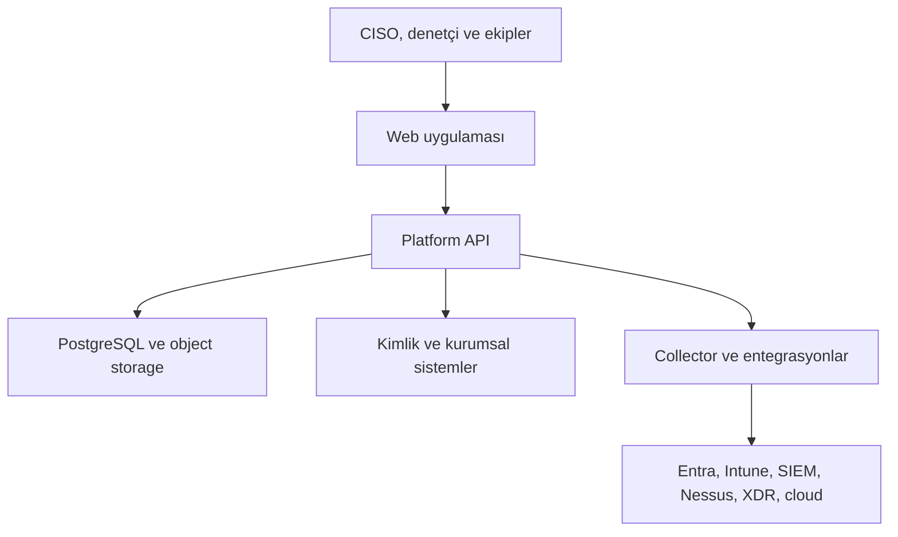
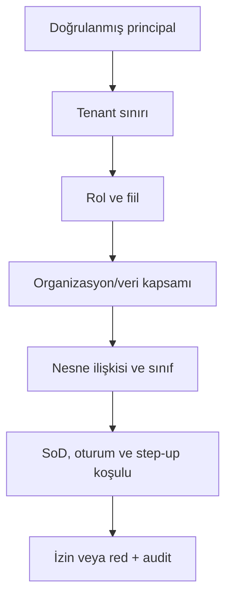

# CISO GRC & Assurance Platform — Teknik Uygulama Mimarisi

**Belge Kodu:** ARCH-001  
**Sürüm:** 1.0  
**Tarih:** 6 Ağustos 2026  
**Durum:** Uygulama geliştirme temeli  
**Bağlı belgeler:** CHARTER-001, PRD-001, IA-001, IAM-001, DATA-001, RISK-001, DB-001

## 1. Sonuç ve mimari karar

Platform, domain sınırları belirlenmiş bir **modüler monolit** olarak başlayacaktır. Tek deployable backend içinde her domain kendi uygulama, domain ve persistence sınırını koruyacak; doğrudan çapraz-domain tablo erişimi yasak olacaktır. Yük ve organizasyon ihtiyacı doğduğunda modüller aynı sözleşmeler korunarak bağımsız servislere ayrılabilecektir.

Ana teknoloji seti:

| Katman | Karar |
|---|---|
| Web uygulaması | Next.js 16 Active LTS, React, TypeScript strict mode |
| Backend API | ASP.NET Core üzerinde .NET 10 LTS |
| Domain yaklaşımı | Modüler monolit, DDD-lite, vertical slice ve explicit use case |
| Veritabanı | PostgreSQL 16 uyumlu başlangıç; desteklenen güncel major'a kontrollü yükseltme |
| ORM/veri erişimi | EF Core; kritik rapor ve bulk işlemlerde ölçümlü raw SQL/Npgsql |
| Dosya/ham kanıt | S3 uyumlu object storage; immutable/WORM seçeneği |
| Arama | OpenSearch; PostgreSQL sistem kaydı olmaya devam eder |
| Cache/dağıtık kilit | Redis; iş verisinin kaynağı değildir |
| Asenkron mesajlaşma | Transactional outbox + broker adapter |
| Workflow | Uygulama içi durable state machine; uzun/karmaşık akışlar için Temporal adapter |
| Kimlik | OIDC/OAuth 2.1; Entra ID, Okta, ADFS/federation; SCIM 2.0 |
| Policy enforcement | API katmanında RBAC + ABAC + ReBAC + SoD; DB'de tenant RLS |
| Gözlemlenebilirlik | OpenTelemetry traces, metrics ve structured logs |
| Deployment | OCI container; Kubernetes/OpenShift ve basit container platformu profilleri |
| API biçimi | REST/JSON, OpenAPI 3.1; webhook ve event sözleşmeleri |
| Yerelleştirme | Türkçe/İngilizce; UTC storage, kullanıcı/tenant timezone sunumu |

.NET 10, Kasım 2028'e kadar desteklenen LTS tabanıdır. Next.js 16 Active LTS'tir. PostgreSQL major sürümleri beş yıl desteklenir; üretimde seçilen major'ın en güncel minor sürümü kullanılacaktır.

## 2. Mimari hedefler

1. Riskten kanıta ve yönetim kararına kadar değiştirilemez iz üretmek.
2. SaaS multi-tenant, dedicated tenant ve on-prem dağıtımlarında aynı ürün çekirdeğini kullanmak.
3. Tenant izolasyonunu yalnızca UI filtresine bırakmamak.
4. Framework, kontrol, risk, kanıt ve audit kayıtlarının tarihsel bütünlüğünü korumak.
5. İnsan onayı gerektiren kararları otomasyon veya AI sonucundan ayırmak.
6. Uzun süren audit, CAPA, risk kabulü ve kanıt talebi süreçlerini yeniden başlatılabilir yürütmek.
7. Entegrasyon arızalarının ana işlemi ve audit izini kaybettirmemesini sağlamak.
8. Modüllerin bağımsız geliştirilebilmesini, fakat kopya ana veri üretmemesini sağlamak.
9. On-prem müşteride cloud'a zorunlu bağımlılık oluşturmamak.
10. Ölçmeden mikroservise bölünmemek.

## 3. Sistem bağlamı



Platform API bütün iş kararlarının güven sınırıdır. Web uygulaması bir güvenlik enforcement noktası değildir. Collector'lar kaynak sistemlerden veri alır ancak doğrudan domain tablolarına yazmaz; imzalı/kimlikli ingestion API veya mesaj sözleşmesi kullanır.

## 4. Deployable bileşenler

### 4.1 Web

- Server-rendered shell ve route-level authorization hint
- Client-side yoğun tablo, grafik, kanban ve ilişki görünümleri
- Backend-for-frontend değildir; business rule içermez
- HTTP-only secure session cookie veya kurumsal OIDC akışı
- CSP nonce, Trusted Types hazırlığı, CSRF koruması ve güvenli header seti
- Hassas veriyi browser storage'a kalıcı yazmama
- Büyük export işlemlerini arka plan işi olarak başlatma
- Erişilebilirlik hedefi WCAG 2.2 AA

### 4.2 Platform API

- Kimlik doğrulama ve policy enforcement
- Use case orchestration
- Domain invariants
- Transaction ve outbox yazımı
- Idempotency ve optimistic concurrency
- Kanonik audit event üretimi
- OpenAPI sözleşmesi
- Sync API'de uzun entegrasyon işi çalıştırmama

### 4.3 Worker

- Outbox publish
- Bildirim ve SLA hesapları
- Scheduled control testleri
- Evidence hash/metadata işlemleri
- Export ve rapor üretimi
- Search projection güncellemesi
- Connector job orchestration
- Retry, backoff, dead-letter ve manuel replay

Worker ile API aynı uygulama çekirdeğini paylaşabilir, ancak ayrı process/deployment olarak ölçeklenir.

### 4.4 Collector gateway

- Connector kayıt ve kimlik doğrulaması
- Collector sürümü ve health durumu
- Ingestion schema validation
- Rate limit ve payload sınırı
- Ham çıktının object storage'a güvenli aktarımı
- Normalize edilmiş bulguların staging alanına alınması
- Human review gerektiren sonuçların kesin uygunluk üretmemesi

### 4.5 Workflow runtime

İlk sürümde workflow tanımı, instance, task, transition, timer ve approval verileri PostgreSQL'de durable tutulur. Motor yalnızca şu deterministik kabiliyetleri sağlar:

- State transition
- Assignee ve candidate group
- Maker-checker/SoD gate
- SLA ve escalation timer
- Reminder
- Delegation
- Cancellation/supersede
- Business calendar
- Immutable transition history

Çok uzun süreli, yüksek hacimli veya çok sistemli orchestration ihtiyacında `IWorkflowRuntime` adapter'ı Temporal implementasyonuna geçirilebilir. Domain nesnesinin kesin durumu yine platform DB'sindedir; workflow motoru tek başına system of record değildir.

## 5. Backend modül sınırları

| Modül | Sorumluluk | Sahip olduğu ana nesneler |
|---|---|---|
| Platform | Tenant, feature, configuration, audit altyapısı | Tenant, setting, idempotency, outbox |
| IdentityAccess | Principal, group, role, policy context | Principal, membership, role assignment |
| Organization | Tüzel kişilik, birim, lokasyon, kapsam | Org unit, scope, committee, ownership |
| Asset | Varlık, süreç, hizmet, veri ve bağımlılık | Asset, service, process, dependency |
| Obligation | Framework ve yükümlülük | Framework, requirement, applicability |
| Control | Ortak hedef ve kurum uygulaması | Objective, implementation, mapping |
| Risk | Senaryo, değerlendirme, tedavi ve kabul | Risk, assessment, score, treatment |
| Evidence | Kanıt, versiyon, kapsam ve eligibility | Evidence item/version/request/decision |
| Assurance | Test planı, örneklem, test ve sign-off | Test definition, assessment, result |
| Audit | Audit universe, engagement ve workpaper | Audit, plan, workpaper, report |
| Issue | Bulgu, CAPA, aksiyon ve kapanış | Finding, action, validation |
| Policy | Doküman, istisna ve attestation | Policy, version, exception, attestation |
| Privacy | ROPA, DPIA, DSAR ve veri aktarımı | Processing activity, DPIA, request |
| TPRM | Tedarikçi ve dördüncü taraf riski | Vendor, assessment, contract, issue |
| Resilience | BIA, BCM, DR ve kriz egzersizi | BIA, plan, exercise, dependency |
| SecOps | Zafiyet, olay ve teknik bulgu bağlantısı | Observation, vulnerability, incident ref |
| AI Governance | AI sistem, model ve değerlendirme | AI system, model, use case, assessment |
| Reporting | Read model, snapshot ve export | Dashboard projection, report snapshot |
| Integration | Connector ve source mapping | Connector, credential ref, run, mapping |
| Workflow | Task, approval, timer ve delegation | Definition, instance, task, transition |

Kurallar:

- Bir modül başka modülün tablosuna doğrudan repository açamaz.
- Sync ihtiyaçta public application contract; async ihtiyaçta integration event kullanılır.
- Döngüsel modül bağımlılığı build-time architecture testinde reddedilir.
- Global kimlikler UUID; dış sistem kimliği source namespace ile birlikte tutulur.
- Reporting projection, transactional domain tablolarının sahibi değildir.

## 6. Kod organizasyonu

```text
src/
  web/
  api/
    Host/
    BuildingBlocks/
    Modules/
      Risk/
        Domain/
        Application/
        Infrastructure/
        Contracts/
        Api/
      Control/
      Evidence/
      Assurance/
      Issue/
  worker/
  collectors/
tests/
  Unit/
  Integration/
  Architecture/
  Contract/
  EndToEnd/
db/
  migrations/
deploy/
  compose/
  helm/
docs/
  adr/
  api/
```

Her use case; request/command, validator, authorization requirement, handler, result ve audit classification içerir. Generic repository ve reflection tabanlı sihirli CRUD kullanılmaz; kritik iş kuralları açıkça görülür.

## 7. API sözleşmesi

### 7.1 Temel kurallar

- Base path: `/api/v1`
- JSON alanları `camelCase`
- Zaman damgaları RFC 3339 UTC
- Para değeri amount + ISO 4217 currency
- Sayfalama opaque cursor ile; büyük tablolarda offset varsayılan değildir
- Filtreler allow-list ve typed schema ile
- Hata biçimi RFC 9457 Problem Details uyumlu
- Create işlemlerinde `Idempotency-Key`
- Update işlemlerinde `ETag` / `If-Match`
- Correlation için `traceparent` ve `X-Correlation-Id`
- Tenant header istemciden güvenilir kabul edilmez; tenant doğrulanmış session/claim ve route bağlamından çözülür
- API tarafından verilen kararlar `decisionId`, `policyVersion` ve gerekçe kodu taşıyabilir

### 7.2 Örnek kaynaklar

| Method | Endpoint | Amaç |
|---|---|---|
| GET | `/api/v1/risks` | Yetkili kapsamdaki riskleri listele |
| POST | `/api/v1/risks` | Taslak risk senaryosu oluştur |
| GET | `/api/v1/risks/{riskId}` | Risk ve izlenebilir bağlantıları getir |
| POST | `/api/v1/risks/{riskId}/assessments` | Yeni değerlendirme revision'ı başlat |
| POST | `/api/v1/risk-assessments/{id}/submit` | Bağımsız incelemeye gönder |
| POST | `/api/v1/risk-assessments/{id}/approve` | Yetkili maker-checker onayı |
| GET | `/api/v1/controls/{id}` | Kontrol uygulaması ve kapsamı |
| POST | `/api/v1/control-assessments` | Kontrol testi başlat |
| POST | `/api/v1/evidence/upload-sessions` | Güvenli doğrudan upload oturumu |
| POST | `/api/v1/evidence/{id}/versions` | Yeni değişmez kanıt sürümü oluştur |
| POST | `/api/v1/evidence-eligibility/evaluate` | Belirli amaç için uygunluk değerlendir |
| POST | `/api/v1/findings` | Bulgu oluştur |
| POST | `/api/v1/actions/{id}/submit-closure` | Kapanış kanıtını incelemeye gönder |
| POST | `/api/v1/actions/{id}/validate-closure` | Bağımsız kapanış doğrulaması |
| GET | `/api/v1/entities/{type}/{id}/trace` | Kaynak kayda kadar ilişki izi |
| POST | `/api/v1/exports` | Yetkili asenkron export oluştur |

### 7.3 Command cevabı

```json
{
  "data": {
    "id": "0198...",
    "status": "submitted",
    "version": 4
  },
  "meta": {
    "correlationId": "0198...",
    "workflowTaskId": "0198..."
  }
}
```

### 7.4 Problem Details örneği

```json
{
  "type": "https://product.example/problems/sod-violation",
  "title": "Görevler ayrılığı kuralı işlemi engelledi",
  "status": 403,
  "code": "SOD_MAKER_CANNOT_APPROVE",
  "correlationId": "0198...",
  "errors": []
}
```

Hata mesajı başka tenant, gizli nesne veya var olmayan/yetkisiz nesne ayrımını sızdırmamalıdır.

### 7.5 Bulk ve export

- Bulk command en fazla yapılandırılmış sayıda kayıt alır.
- Her kayıt için başarı/hata sonucu ayrı döner.
- İşlem atomic veya partial modunu sözleşmede açıkça belirtir.
- Büyük import staging, validation ve explicit commit adımlarından geçer.
- Export anlık request içinde üretilmez; job tamamlanınca kısa ömürlü yetkili indirme bağlantısı verilir.
- Export dosyası sınıflandırma, watermark, kapsam, üretici ve son kullanma metadata'sı taşır.

## 8. Event sözleşmesi ve outbox

Her domain transaction'ı iş kaydı ile aynı PostgreSQL transaction'ında outbox mesajı yazar. Publisher mesajı broker'a iletir; consumer inbox/idempotency kaydıyla tekrar teslimi güvenli işler.

Event envelope:

```json
{
  "eventId": "0198...",
  "eventType": "risk.assessment.approved.v1",
  "occurredAt": "2026-08-06T08:00:00Z",
  "tenantId": "0198...",
  "actorId": "0198...",
  "correlationId": "0198...",
  "causationId": "0198...",
  "schemaVersion": 1,
  "classification": "internal",
  "payload": {}
}
```

Kurallar:

- Event payload yalnızca gerekli alanları taşır; kanıt içeriği ve secret taşımaz.
- Consumer aynı event'i birden çok kez alabileceğini varsayar.
- Breaking change yeni event version üretir.
- Dead-letter kayıtları tenant, connector ve correlation ile yönetilir.
- Replay, yetkili ve audit edilen operasyondur.

## 9. Kimlik doğrulama ve oturum

### 9.1 Kurumsal kullanıcı

- Authorization Code + PKCE
- OIDC discovery ve imzalı token doğrulama
- Issuer, audience, signature, nonce ve zaman kontrolleri
- Entra ID/Okta group/role claim'lerini doğrudan sınırsız yetkiye çevirmeme
- Dış kimliği iç principal ve kontrollü role assignment ile eşleme
- JIT provisioning tenant policy'ye bağlı; varsayılan kapalı
- SCIM provisioning tercih edilir

### 9.2 Dış denetçi ve tedarikçi

- Ayrı external principal tipi
- Denetim/assessment/workspace ilişkisinden türeyen ReBAC
- Zaman sınırlı erişim
- Export ve download ayrı izin
- Gerekli durumda step-up MFA
- Sözleşme bitişi ve engagement kapanışında otomatik revoke

### 9.3 Servis ve collector kimliği

- Workload identity veya mTLS client identity
- Kısa ömürlü token
- Her connector için ayrı principal ve kapsam
- Secret değerinin DB/log/audit event'e yazılmaması
- Credential rotation ve son kullanım görünürlüğü

## 10. Yetkilendirme karar zinciri



Policy input:

- Principal, tenant, rol ve grup
- İstenen action
- Resource type/id/status/owner
- Organizasyon ve engagement kapsamı
- Veri sınıfı ve kişisel veri durumu
- Maker/reviewer ilişkisi
- MFA, cihaz güveni ve oturum yaşı
- Delegation ve break-glass durumu

Liste endpoint'lerinde önce query scope uygulanır; nesneler çekilip uygulamada tek tek filtrelenmez. Tek kayıt erişiminde hem scope hem resource policy kontrol edilir.

## 11. Tenant izolasyonu

Savunma katmanları:

1. Doğrulanmış kimlikten tenant context
2. API request scope
3. Application authorization policy
4. Repository query scope
5. PostgreSQL `SET LOCAL` + `FORCE ROW LEVEL SECURITY`
6. Composite tenant foreign key
7. Tenant prefix'li object storage key ve bucket policy
8. Tenant-aware cache key
9. Tenant-tagged trace/log; hassas içerik olmadan
10. Cross-tenant otomatik testler

Dedicated tenant aynı kodu ayrı compute, DB, storage, KMS key ve opsiyonel search cluster ile çalıştırır. On-prem dağıtımda lisans/telemetry bağlantısı kesildiğinde ürünün temel güvenlik fonksiyonu çalışmaya devam eder.

## 12. Kanıt güvenlik mimarisi

Kanıt upload akışı:

1. API upload niyetini, yetkiyi, sınıflandırmayı ve beklenen boyutu doğrular.
2. Kısa ömürlü, tek amaçlı object storage upload izni üretir.
3. Client/collector binary'yi doğrudan storage'a yollar.
4. Worker malware/content-type kontrolü ve SHA-256 doğrulaması yapar.
5. Başarılı sonuç yeni immutable `evidence_version` oluşturur.
6. Kanıt onay ve eligibility akışına girer.

Zorunlu kontroller:

- Executable/macro/archive policy
- MIME ile magic-byte karşılaştırması
- Boyut ve decompression bomb limiti
- Quarantine prefix/bucket
- Müşteri bazlı KMS key veya BYOK
- Object versioning ve retention lock/WORM seçeneği
- Download authorization her istekte yeniden değerlendirilir
- Signed link kısa ömürlü ve tek nesne/kapsamla sınırlı
- Preview sandbox; aktif içerik çalıştırılmaz
- Hash uyuşmazlığında kullanım bloklanır ve security event üretilir
- Retention/legal hold ve güvenli imha workflow'u

## 13. Search ve raporlama

PostgreSQL tek system of record'dur. OpenSearch yalnızca arama/read projection'dır.

- Outbox event ile projection güncellenir.
- Projection lag ölçülür.
- Yetki filtreleri index dokümanında scope token'larıyla uygulanır; API ayrıca doğrular.
- Hassas alanlar varsayılan olarak indexlenmez.
- Silme/anonimleştirme event'i search ve cache katmanına yayılır.
- Yönetim raporları belirli `asOfAt`, metodoloji ve filtre snapshot'ı taşır.
- Dashboard verisi kaynak kayıt ve kanıta drill-down edilebilir.
- Uyum yüzdesi tek başına sonuç değildir; kapsam, kanıt güveni, test güncelliği ve istisna görünürdür.

## 14. Entegrasyon mimarisi

Connector yaşam döngüsü:

`draft → validating → active → degraded → suspended → retired`

Her connector:

- Tenant ve source system
- Yetki kapsamı
- Credential reference
- Data residency
- Rate limit
- Poll/webhook yöntemi
- Schema/collector version
- Health ve last successful run
- Mapping ve normalization version
- Owner ve approver
- Decommission/credential revoke

taşır.

Başlangıç connector aileleri:

- Microsoft Graph: Entra ID, Intune, Defender, Purview
- Azure/AWS güvenlik konfigürasyonu
- Sentinel ve SIEM kaynak sağlığı
- Nessus/Tenable zafiyet bulguları
- Cortex XDR/EDR coverage
- Wazuh güvenlik olayları
- Fortinet/FortiAnalyzer
- PAM/CyberArk/Segura
- GitHub/GitLab ve CI/CD
- HRIS offboarding
- CMDB/Snipe-IT/ServiceNow sınıfı kaynaklar

Kaynak verisi önce staging + provenance ile alınır; normalizasyon hatası domain kaydını sessizce bozmaz. Otomatik test sonucu `proposed` veya `machine_observed` durumundadır; ürün kuralı gerektiriyorsa insan sign-off olmadan `approved/effective` olmaz.

## 15. Workflow, onay ve SoD

Her yüksek etkili işlem workflow policy'ye bağlanabilir:

- Risk değerlendirme ve override
- Risk kabulü
- Kontrol etkinliği sign-off
- Kanıt onayı ve eligibility override
- Bulgu kapanışı
- Policy publication ve exception
- Tedarikçi kabulü
- DPIA kararı
- Audit report yayınlama
- Export ve break-glass

Bir transition:

- Önkoşul
- Yetkili aktör/candidate group
- SoD expression
- Zorunlu gerekçe
- Zorunlu kanıt
- SLA/timer
- Notification
- Üretilen domain event
- Audit severity

taşır. Workflow tanımları versiyonlanır; çalışan instance başladığı versiyonda kalır. Policy değişikliği geçmiş onayı yeniden yazmaz.

## 16. Audit trail ve non-repudiation

Her kritik command için:

- Actor ve impersonator
- Tenant ve scope
- Action ve entity/version
- Önceki/sonraki güvenli özet
- Gerekçe
- Correlation/causation/request/session
- Policy decision ve workflow transition
- Timestamp
- Previous hash/event hash

üretilir.

Audit writer ayrı DB rolü kullanır. Normal servis audit kaydını UPDATE/DELETE edemez. Hash-chain anchor periyodik olarak ayrı immutable storage veya SIEM'e gönderilir. PII/secret değerleri audit payload'a kopyalanmaz; gerektiğinde redacted reference tutulur.

## 17. Gözlemlenebilirlik

### 17.1 Sinyaller

- Distributed trace: API → DB/outbox → worker → connector
- Metric: latency, error, saturation, queue depth, workflow timer, projection lag
- Structured log: event adı, tenant pseudonymous id, correlation, module, outcome
- Domain operational metric: expired evidence, failed controls, overdue actions

### 17.2 Güvenli logging

Loglanmayacaklar:

- Access/refresh token
- Cookie/session secret
- Connector credential
- Kanıt içeriği
- Tam kişisel veri
- Authorization header
- Signed URL query

Log pipeline redaction testleri CI'da çalışır. Güvenlik ve audit logları operasyon logundan farklı retention/erişim politikasına sahip olabilir.

### 17.3 SLO başlangıç hedefleri

| Sinyal | Başlangıç hedefi |
|---|---|
| Kritik read API kullanılabilirliği | Aylık %99,9 SaaS hedefi |
| Kritik write API kullanılabilirliği | Aylık %99,9 SaaS hedefi |
| Basit read p95 | 500 ms altı, cache hariç ölçüm |
| Command kabul p95 | 800 ms altı; uzun iş async |
| Outbox publish gecikmesi p95 | 30 saniye altı |
| Search projection gecikmesi p95 | 60 saniye altı |
| RPO | Üretim profilinde 15 dakika veya daha iyi |
| RTO | Profil ve sözleşmeye göre; başlangıç SaaS hedefi 4 saat |

Kesin SLA pilot kapasite ve maliyet ölçümünden sonra sözleşmeye dönüştürülür.

## 18. Deployment profilleri

### 18.1 Shared SaaS

- Shared stateless compute
- Ortak PostgreSQL cluster içinde tenant RLS
- Tenant bazlı storage prefix/key
- Gerekli müşteride dedicated DB/storage seçeneği
- Türkiye ve AB veri lokasyonu profilleri

### 18.2 Dedicated tenant

- Ayrı namespace/cluster seçeneği
- Ayrı DB, storage ve KMS key
- Müşteri ağ bağlantısı/private endpoint
- Ayrı maintenance window ve retention

### 18.3 Private cloud/on-prem

- OCI images ve Helm chart
- PostgreSQL, S3-compatible storage ve Redis müşteri altyapısında
- OpenSearch opsiyonel; küçük kurulumda PostgreSQL aramasıyla sınırlı profil
- Broker adapter; ilk profil PostgreSQL outbox polling ile çalışabilir
- Offline lisans ve update paketi
- Telemetry opt-in ve yerel observability endpoint
- Entra/Okta/ADFS veya yerel OIDC provider

## 19. Network ve secret sınırları

- Web yalnızca API/approved CDN endpoint'lerine çıkar.
- API public ingress alabilir; DB/storage/broker private network'tedir.
- Worker ve collector outbound allow-list ile çalışır.
- Temporal self-host edilirse public internete açılmaz ve DB kadar kritik kabul edilir.
- Admin/ops erişimi bastion/zero-trust policy ile, JIT ve audit altında yapılır.
- Secret manager olmadan production deploy edilmez.
- Secret referansı config'te; değer environment dump/log içinde görünmez.
- TLS bütün bağlantılarda; mTLS servis/collector profillerinde.

## 20. Güvenli geliştirme yaşam döngüsü

CI zorunlu kapıları:

1. Format/lint ve nullable/TypeScript strict
2. Unit test
3. Architecture boundary test
4. PostgreSQL 16 migration integration test
5. Tenant isolation ve cross-tenant test
6. API contract/OpenAPI breaking-change test
7. SAST ve secret scan
8. Dependency/SBOM ve lisans kontrolü
9. Container/IaC scan
10. DAST smoke
11. Authorization negative tests
12. Audit immutability ve evidence integrity tests

Release:

- Signed artifact ve provenance
- SBOM
- Migration dry-run/compatibility
- Expand–migrate–contract
- Feature flag
- Canary/rolling deployment
- Otomatik health ve smoke
- Uygulama rollback; DB için forward-fix/önceden hazırlanmış geri dönüş prosedürü

## 21. Veri koruma ve privacy-by-design

- Data classification her domain nesnesinde veya kapsam ilişkisinde taşınabilir.
- PII alanları field-level policy ve gerektiğinde application encryption kullanır.
- Encryption anahtarı tenant/dağıtım profiline göre ayrılır.
- Retention, legal hold ve anonymization workflow ile uygulanır.
- Backup restore edilirken aynı tenant ve key sınırı korunur.
- Non-production ortamına üretim verisi varsayılan olarak kopyalanmaz.
- Support access varsayılan kapalı; süreli break-glass ve müşteri görünürlüğü.
- Veri dışa aktarımı ve residency ihlali audit/security event üretir.

## 22. AI mimari sınırı

AI aşağıdaki işleri yalnızca öneri olarak yapabilir:

- Kontrol/framework eşleme önerisi
- Kanıt sınıflandırma ve metadata önerisi
- Bulgu/kök neden taslak özeti
- Risk senaryosu veya yönetim özeti taslağı
- Regülasyon değişikliği etki adayları

AI sonucu:

- `proposed` olarak etiketlenir.
- Model/provider/version ve prompt template version taşır.
- Kullanılan kaynak referanslarını gösterir.
- İnsan onayı olmadan risk skoru, uygunluk, kontrol etkinliği veya audit kapanışı üretmez.
- Tenant verisi varsayılan olarak model eğitimi için kullanılamaz.
- Hassas veri için redaction, allow-list ve private model/provider policy uygulanır.
- Prompt injection ve retrieval poisoning kontrolleri connector/ingestion sınırında ele alınır.

## 23. İlk çalışan dikey dilim

İlk kod tabanı yalnızca boş dashboard olmayacaktır. Aşağıdaki zincir gerçek DB, API, authorization, workflow ve audit ile çalışacaktır:

1. OIDC development identity ve tenant context
2. Varlık oluşturma/listeleme
3. Risk senaryosu oluşturma
4. Doğal risk değerlendirme taslağı
5. Kontrol uygulamasını riske bağlama
6. Kanıt upload metadata ve immutable version
7. Kontrol assessment/test sonucu
8. Maker-checker sign-off
9. Bulgu ve aksiyon oluşturma
10. Bağımsız kapanış doğrulaması
11. Entity trace ve audit timeline

UI ekran zinciri DB-001 ile sabitlenen şu akışı izler:

`HOME-002 → AST-003/AST-002 → RSK-002/RSK-003 → CTL-002/CTL-003 → EVD-004/EVD-006 → CTL-007 → FND-002/FND-005 → AUD-014`

## 24. Repository bootstrap bağımlılık sırası

Bu bir özellik kapsam daraltması değil, inşa sırasıdır:

1. Monorepo, toolchain ve CI
2. PostgreSQL 16 container ve migration runner
3. Host, health, config ve OpenTelemetry
4. Tenant/principal request context
5. RLS transaction interceptor
6. Audit writer ve transactional outbox
7. Organization/Asset modülü
8. Risk/Control modülleri
9. Evidence/Assurance modülleri
10. Issue/Workflow modülleri
11. Next.js shell, design token ve navigation
12. İlk dikey akış
13. E2E ve security acceptance tests
14. Compose local profile ve Helm başlangıcı

## 25. Architecture Decision Records

| ADR | Karar | Durum |
|---|---|---|
| ADR-001 | Modüler monolit; ölçümlü extraction | Accepted |
| ADR-002 | ASP.NET Core / .NET 10 LTS backend | Accepted |
| ADR-003 | Next.js 16 + TypeScript web | Accepted |
| ADR-004 | PostgreSQL system of record ve RLS | Accepted |
| ADR-005 | REST/OpenAPI 3.1 external API | Accepted |
| ADR-006 | Transactional outbox + idempotent consumer | Accepted |
| ADR-007 | Internal durable workflow + Temporal adapter | Accepted |
| ADR-008 | Evidence binary object storage, metadata DB | Accepted |
| ADR-009 | OpenSearch read projection, DB authoritative | Accepted |
| ADR-010 | OIDC/SCIM ve policy-based authorization | Accepted |
| ADR-011 | OCI/Kubernetes/OpenShift portable deployment | Accepted |
| ADR-012 | OpenTelemetry vendor-neutral observability | Accepted |
| ADR-013 | Human-governed AI suggestions | Accepted |

## 26. Reddedilen veya ertelenen seçenekler

| Seçenek | Karar gerekçesi |
|---|---|
| Başlangıçta mikroservis | Operasyon, transaction ve geliştirme maliyeti; ölçülmüş ihtiyaç yok |
| NestJS backend | Uygunsuz değil; ancak enterprise/on-prem, tip güvenliği ve uzun LTS hedefinde .NET seçildi |
| UI'da authorization | Yalnızca görünürlük sağlar; güvenlik sınırı değildir |
| Tek tenant filtresi | Defense-in-depth için yetersiz; RLS ve composite FK zorunlu |
| Kanıtı DB blob olarak tutma | DB büyümesi, retention ve WORM yönetimi nedeniyle reddedildi |
| Her işlem için sync entegrasyon | Kaynak sistem arızasını kullanıcı transaction'ına taşır |
| Event sourcing | Audit ihtiyacı tek başına tüm domaini event-sourced kurmayı gerektirmiyor |
| GraphQL-first | İlk use case ve denetçi entegrasyonları için REST/OpenAPI daha öngörülebilir |
| AI ile otomatik compliance ilanı | Assurance ve yönetişim kuralına aykırı |
| Temporal'ı ilk günden zorunlu kılma | Küçük/on-prem profilde gereksiz operasyonel bağımlılık |

## 27. Açık teknik kararlar

Aşağıdakiler repository bootstrap sırasında ölçüm/prototiple kesinleşecektir:

- UI component library ve design system implementasyonu
- Broker varsayılanı: RabbitMQ, Kafka veya managed service adapter
- Object storage SaaS sağlayıcısı ve on-prem MinIO/Ceph uyumluluk matrisi
- OpenSearch ilk deployment'ta zorunlu mu opsiyonel mi
- Policy engine'in native .NET mi OPA/Cedar adapter mı olacağı
- Elektronik imza/zaman damgası sağlayıcıları
- İlk cloud/region ve DR topology
- Lisans/entitlement enforcement mimarisi

Bu kararlar çekirdek domain modelini değiştirmeyecek adapter/interface sınırlarında tutulacaktır.

## 28. Tehdit modeli başlangıç özeti

| Tehdit | Ana kontroller |
|---|---|
| Cross-tenant veri sızıntısı | Tenant context, API scope, RLS, composite FK, negative test |
| Yetki yükseltme/SoD ihlali | Policy engine, ReBAC, maker-checker, immutable transition |
| Kanıt değiştirme | Immutable version, SHA-256, object version/WORM, audit chain |
| Kötü amaçlı dosya | Quarantine, scanning, preview sandbox, type/size limits |
| Connector credential çalınması | Vault, workload identity, least privilege, rotation |
| Audit silme/manipülasyon | Ayrı writer rolü, append-only trigger, hash-chain anchor |
| Export ile veri kaybı | Ayrı izin, classification, watermark, expiry, audit |
| Supply-chain saldırısı | Pinned dependency, SBOM, signing, provenance, scan |
| Prompt injection/veri sızıntısı | AI isolation, source trust, redaction, human approval |
| Support kötüye kullanımı | Default deny, JIT break-glass, customer-visible audit |

Tam STRIDE/LINDDUN threat model ilk çalışan dikey dilimle birlikte üretilecektir.

## 29. Kabul kriterleri

- [x] Frontend, backend, DB, storage, search, cache, workflow ve deployment kararları tanımlandı.
- [x] Modüler monolit domain sınırları ve extraction yaklaşımı tanımlandı.
- [x] API versioning, hata, idempotency, concurrency ve pagination kuralları tanımlandı.
- [x] OIDC, SCIM, servis/collector kimliği ve dış kullanıcı modeli tanımlandı.
- [x] RBAC+ABAC+ReBAC+SoD karar zinciri tanımlandı.
- [x] Tenant izolasyonu uygulama, DB, storage, cache ve test katmanlarına yayıldı.
- [x] Evidence upload, quarantine, hash, immutable version ve WORM yaklaşımı tanımlandı.
- [x] Transactional outbox, event envelope, retry ve replay kuralları tanımlandı.
- [x] Durable workflow ve Temporal geçiş sınırı tanımlandı.
- [x] Audit, observability, privacy ve AI güvenlik sınırları tanımlandı.
- [x] SaaS, dedicated ve on-prem deployment profilleri tanımlandı.
- [x] CI/CD güvenlik kapıları ve PostgreSQL entegrasyon testleri tanımlandı.
- [x] İlk çalışan dikey dilim ve repository bootstrap sırası tanımlandı.
- [ ] Kararlar çalışan repository iskeletinde doğrulanacak.

## 30. Sonraki teslimat

`APP-001` çalışan repository iskeletidir. İlk adımda .NET 10 API, Next.js 16 web, PostgreSQL 16 local/CI profili, migration runner, tenant context, health/telemetry, audit/outbox temeli ve ilk Asset→Risk dikey akışı kurulacaktır.

## 31. Resmî teknik dayanaklar

- Microsoft .NET lifecycle: https://learn.microsoft.com/en-us/lifecycle/products/microsoft-net-and-net-core
- Next.js support policy: https://nextjs.org/support-policy
- PostgreSQL versioning policy: https://www.postgresql.org/support/versioning/
- Temporal self-hosted guide: https://docs.temporal.io/self-hosted-guide
- Temporal production security: https://docs.temporal.io/self-hosted-guide/deployment
